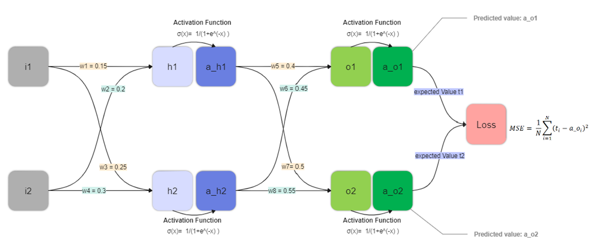

# Neural Network Backpropagation Simulation in Excel

This project demonstrates the fundamentals of neural network training through forward and backward propagation using a custom Excel sheet. The primary focus is on understanding how different parameters, specifically the learning rate, affect the training process and the loss minimization in a neural network without considering bias for simplicity. The Excel sheet allows for interactive experimentation with various learning rates to observe their impact on the error reduction speed and pattern.

## Project Structure

- **Excel Simulation File**: Contains the simulation of forward and backward propagation processes, allowing for hands-on experimentation with learning rates.
- **README.md**: Provides an overview of the project, including explanations of the major steps involved in the simulation and the impact of learning rate adjustments.

## Major Steps Explained

### Forward Propagation

- Inputs are fed into the neural network.
- Weights are applied to the inputs, and the sum is passed through an activation function (sigmoid in this case) to produce the output.

### Backward Propagation

- The loss is calculated by comparing the predicted output against the actual output.
- The gradient of the loss is computed with respect to each weight, indicating how the loss changes as the weights are adjusted.
- Weights are updated in the direction that most reduces the loss, using the calculated gradients and the learning rate.

## Learning Rate Experimentation

The Excel sheet allows the user to select from six different learning rates: [0.1, 0.2, 0.5, 0.8, 1.0, 2.0]. The simulation demonstrates that a higher learning rate, such as 2.0, leads to a steeper descent towards minimal loss, achieving quicker loss reduction. However, it's crucial to balance the learning rate to avoid overshooting the minimum.

## Loss Graph and Learning Rate Impact

The project includes a screenshot in the README file that visualizes the Loss graph for various learning rates. This graph clearly shows how different learning rates impact the speed and pattern of loss reduction during the training process.

## Instructions for Use

1. Open the Excel file provided in the repository.
2. Experiment with different learning rates by selecting from the predefined options.
3. Observe the impact on the error graph and the rate of convergence to minimal loss.

## Conclusion

This Excel-based simulation offers an intuitive understanding of the neural network's learning process, emphasizing the importance of choosing an appropriate learning rate for efficient training. By providing a hands-on tool for visualizing the effects of learning rate adjustments, this project aids in grasifying the foundational concepts of neural network training dynamics.

## How to Contribute

Feel free to fork this repository, experiment with the Excel simulation, and suggest improvements or additional features by submitting pull requests or opening issues.

---

For detailed questions and comments, contacts Ping.Xianping.Wu@gmail.com
