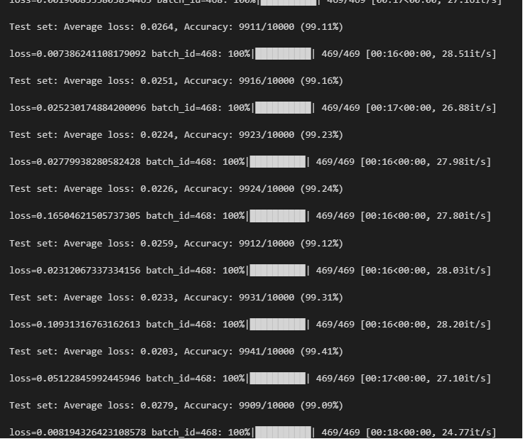

# Improved CNN Model for Enhanced Accuracy

## Goal

The goal of this project is to enhance the model's accuracy and regularization capabilities.

## Strategy

To achieve our aim, we have implemented Dropout and Batch Normalization after activation functions (specifically ReLU) within the convolutional layers of our model. Dropout is strategically added either after an activation function or a pooling layer. It serves to mitigate overfitting by randomly nullifying input units during training, with a predefined probability (e.g., 0.25 or 0.5). Batch Normalization, on the other hand, is applied subsequent to the convolutional layers but prior to the activation function. This technique aids in stabilizing the learning process by normalizing the output of the preceding layer.

## Code Revisions

- **Batch Normalization (`nn.BatchNorm2d`) Integration:** Implemented after each convolutional layer and before the activation function. This aims to normalize the outputs, thereby enhancing training stability.

- **Dropout (`nn.Dropout`) Application:** Inserted after each pooling layer and preceding the final convolutional layer. This approach aims to curtail overfitting by randomly "dropping" units (effectively setting them to zero) during the training process. The dropout probability is configured to 0.25 following the pooling layers and adjusted to 0.5 before the final convolutional layer, to intensify overfitting prevention before the classification stage.

- **Model Accuracy Display Format Adjustment:** To achieve a precise representation, the format specifier for displaying percentage accuracy has been altered from '{:.0f}%' to '{:.2f}%', enabling two decimal places.

- **Removal of ReLU Activation from the Last Layer:** To ensure the output layer's effectiveness in classification tasks, the ReLU activation function has been omitted from the final layer.

## Achievements

  - [x] Successful integration of both Batch Normalization and Dropout techniques.
  - [x] The model operates with much less than 20K parameters.
  - [x] Achieved the desired accuracy in fewer than 20 epochs.
  - [x] Attained a peak validation accuracy of 99.61%.

 

---

This project/assignment demonstrates the effectiveness of incorporating Dropout and Batch Normalization techniques within CNN architectures, particularly for enhancing model accuracy and regularization with a minimal parameter count and within a constrained number of training epochs.

For detailed questions and comments, contacts Ping.Xianping.Wu@gmail.com
   

