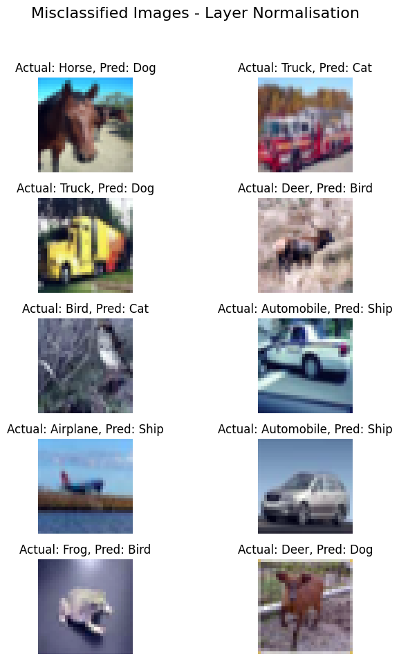
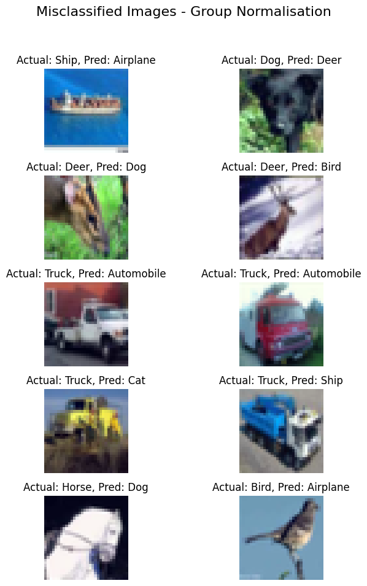

# CIFAR10 Classification with Different Normalization Techniques

## Overview
This project explores the impact of different normalization techniques on the performance of a convolutional neural network (CNN) architecture, specifically designed for the CIFAR10 dataset. The primary goal is to analyze how Batch Normalization (**BN**), Layer Normalization (**LN**), and Group Normalization (**GN**) affect model training, generalization, and the ability to achieve high accuracy with a constrained parameter budget.

## Network Architecture
The base model, referred to as **NetA** for **BN**, **NetB** for the **LN** variation and **NetC** for the **GN** variations, follows a specified architecture that includes convolutional layers, pooling layers, and normalization layers with a total parameter count kept under 50,000. The network structure is outlined as follows: $C_{1}$, $C_{2}$, $c_{3}$ (1x1 convolution), $P_{1}$ (pooling), $C_{4}$, $C_{5}$, $C_{6}$, $c_{7}$ (1x1 convolution), $P_{2}$ (pooling), $C_{8}$, $C_{9}$, $C_{10}$, followed by a Global Average Pooling (GAP) layer and a final $c_{11}$ (1x1 convolution) layer for classification.

## Normalization Techniques and Findings

### Batch Normalization (BN) Network Analysis
**Achievement:** The BN model successfully achieved over 70% accuracy on CIFAR10, demonstrating the effectiveness of BN in enhancing training stability and model generalization.

**Key Insight:** BN proved crucial for maintaining high performance without necessitating data augmentation, highlighting its role in efficient neural network design within the parameter constraints.

### Layer Normalization (LN) Network Analysis

**Challenges:** The LN model presented tuning challenges, especially regarding model channels and learning rate adjustments, reflecting LN's sensitivity to hyperparameter configurations.

**Outcome:** Despite edging the 50k parameter limit, the LN model achieved the target accuracy, emphasizing the nuanced balance between model complexity and performance when using LN.

### Group Normalization (GN) Network Analysis

**Efficiency: **Incorporating GN resulted in a straightforward achievement of both the parameter limit and desired accuracy, underlining GN's robustness and efficiency in model normalization.

**Advantages:** GN significantly contributed to model performance without increasing architectural complexity, showcasing its potential in lean yet effective model design.

## Misclassified Images Analysis

For each normalization technique, we identified and analyzed 10 misclassified images, providing insights into the model's limitations and potential areas for improvement. These analyses are presented through 5x2 image matrices, separately annotated for BN, GN, and LN models, the details refer to the notebook `s8.ipynb` 
 

## Conclusion
The comparative study of BN, LN, and GN within a constrained parameter framework on the CIFAR-10 dataset offers valuable insights into the strategic application of normalization techniques in CNNs. The findings highlight the distinct advantages and considerations associated with each method, contributing to a broader understanding of how to optimize neural network performance across varying architectural constraints and objectives.

## License
This project is licensed under the MIT License - see the LICENSE.md file for details.